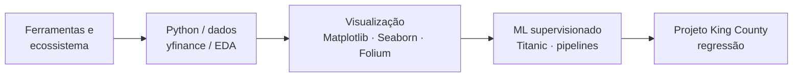

<p align="center">
  <a href="https://www.ibm.com/training/data-science" target="_blank" rel="noopener noreferrer">
    
  </a>
</p>

<h1 align="center">IBM Data Science — repositório da certificação</h1>
<h3 align="center">Laboratórios Coursera / Skills Network · notebooks, dados e exercícios avaliados</h3>

<p align="center">
  
  
  
  
</p>

<p align="center">
  <a href="#readme-sobre">Sobre</a> ·
  <a href="#readme-conteudo">Conteúdo</a> ·
  <a href="#readme-trilha">Trilha</a> ·
  <a href="#readme-tecno">Stack</a> ·
  <a href="#readme-exec">Como executar</a> ·
  <a href="#readme-estrutura">Estrutura</a> ·
  <a href="#readme-cert">Certificação</a> ·
  <a href="#readme-autor">Autor</a>
</p>

---

<a id="readme-sobre"></a>
## Sobre

Este repositório agrega **notebooks e ficheiros** utilizados ao longo do **IBM Data Science Professional Certificate** (Coursera / **IBM Skills Network**): desde o módulo introdutório de **ferramentas e ecossistema** até **visualização de dados**, **projetos práticos** (Titanic, imóveis em King County) e análise financeira com **yfinance** — sempre com foco pedagógico e entregáveis dos laboratórios oficiais.

> Os enunciados e datasets seguem as versões distribuídas nos cursos IBM (URLs Cloud Object Storage / JupyterLite quando aplicável).

---

<a id="readme-conteudo"></a>
## Conteúdo do repositório

| Artefacto | Descrição |
|-----------|-----------|
| `notebooks/DataScienceEcosystem.ipynb` | **Data Science Tools** — linguagens, bibliotecas, ferramentas open-source, exemplos em Python (ecossistema). |
| `notebooks/tesla_data.ipynb` | Dados de ações (**yfinance**), extração e visualização (ex.: Tesla / contexto financeiro do curso). |
| `notebooks/DV0101EN-Final-Assignment-Part1-v2.ipynb` | **DV0101EN** — visualizações com **Matplotlib**, **Seaborn** e **Folium** (parte 1 do trabalho final da disciplina). |
| `scripts/DV0101EN-Final-Assign-Part-2-Questions.py` | Parte 2 do mesmo módulo — exercícios em script Python. |
| `notebooks/House_Sales_in_King_Count_USA-*.jupyterlite.ipynb` | **Projeto final** — vendas de casas em **King County** (regressão / EDA conforme enunciado); lê `data/kc_house_data_NaN.csv` (caminho relativo ao notebook). |
| `data/kc_house_data_NaN.csv` | Dataset associado ao projeto de imóveis (tratamento de em falta conforme o lab). |
| `notebooks/Practice Project-v1.ipynb` | **Practice Project** — **Titanic**: *Random Forest* vs *Logistic Regression*, pipeline, `GridSearchCV`, matriz de confusão, importância de *features*. |
| `figures/*.png` | Gráficos exportados dos laboratórios (referências visuais). |
| `requirements.txt` | Dependências Python para executar os notebooks localmente. |

---

<a id="readme-trilha"></a>
## Trilha de aprendizagem (visão geral)



---

<a id="readme-tecno"></a>
## Stack e bibliotecas

| Área | Ferramentas (indicativas) |
|------|---------------------------|
| **Core** | Python, Jupyter, `pandas`, `numpy` |
| **Visualização** | `matplotlib`, `seaborn`, `plotly` |
| **ML** | `scikit-learn` (pipelines, `GridSearchCV`, classificação e regressão) |
| **Dados externos** | `yfinance`, `requests`, `beautifulsoup4` |
| **Ambiente** | `jupyter`, `notebook`, `ipykernel` |

Lista instalável consolidada em **`requirements.txt`**.

---

<a id="readme-exec"></a>
## Como executar

```bash
git clone https://github.com/sidnei-almeida/ibm_ds_certificate.git
cd ibm_ds_certificate

python3 -m venv .venv
source .venv/bin/activate   # Windows: .venv\Scripts\activate

pip install -r requirements.txt

jupyter notebook
# ou: jupyter lab
```

Na raiz do repositório, abre os ficheiros em **`notebooks/`** e corre as células na ordem do laboratório. Para o script da parte 2:

```bash
python scripts/DV0101EN-Final-Assign-Part-2-Questions.py
```

---

<a id="readme-estrutura"></a>
## Estrutura do repositório

```
ibm_ds_certificate/
├── data/
│   └── kc_house_data_NaN.csv
├── figures/              # gráficos exportados (PNG)
├── notebooks/
│   ├── DataScienceEcosystem.ipynb
│   ├── tesla_data.ipynb
│   ├── DV0101EN-Final-Assignment-Part1-v2.ipynb
│   ├── House_Sales_in_King_Count_USA-20231003-1696291200.jupyterlite.ipynb
│   └── Practice Project-v1.ipynb
├── scripts/
│   └── DV0101EN-Final-Assign-Part-2-Questions.py
├── requirements.txt
└── README.md
```

---

<a id="readme-cert"></a>
## Certificação

O **IBM Data Science Professional Certificate** (Coursera) cobre, entre outros tópicos: fundamentos de Data Science, ferramentas, metodologia, Python, SQL, análise e visualização de dados, machine learning e **projeto final** integrador.

Este repositório é **material de estudo e portfólio** — não substitui o certificado oficial; a conclusão é validada pela plataforma Coursera / IBM.

---

## Disclaimer

Uso **educacional**. Os notebooks reproduzem exercícios dos cursos IBM; **dados financeiros** (ações) e **resultados de modelos** são ilustrativos e **não** constituem recomendação de investimento.

---

<a id="readme-autor"></a>
## Autor

| | |
| --- | --- |
| **Nome** | **Sidnei Alves de Almeida** |
| **Perfil** | Cientista de Dados · Python · Machine Learning |
| **LinkedIn** | [Sidnei Almeida](https://www.linkedin.com/in/saaelmeida93/) |
| **GitHub** | [@sidnei-almeida](https://github.com/sidnei-almeida) |

---

## Créditos

- **IBM** e **Coursera** — programa *IBM Data Science Professional Certificate* e conteúdos **Skills Network**.
- Comunidades open source: **Project Jupyter**, **NumPy**, **pandas**, **scikit-learn**, etc.

<p align="center">
  <a href="https://skills.network" target="_blank" rel="noopener noreferrer">
    
  </a>
</p>

<p align="center">
  <sub>Transformar dados em insights, insights em conhecimento, conhecimento em impacto.</sub>
</p>

<p align="center">
  Se este repositório foi útil, considera dar uma ⭐ no GitHub.
</p>
