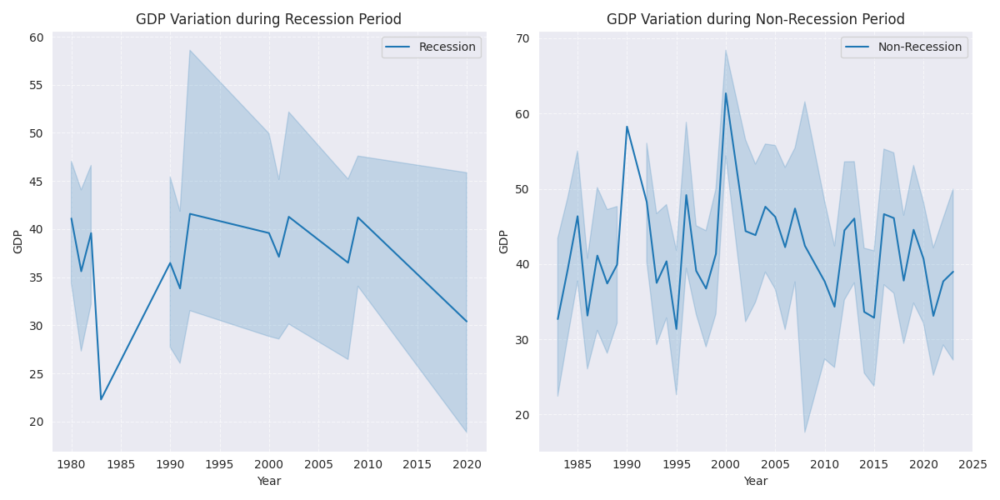
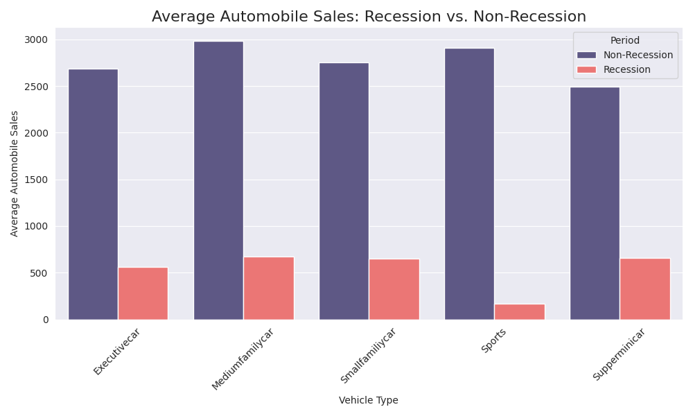
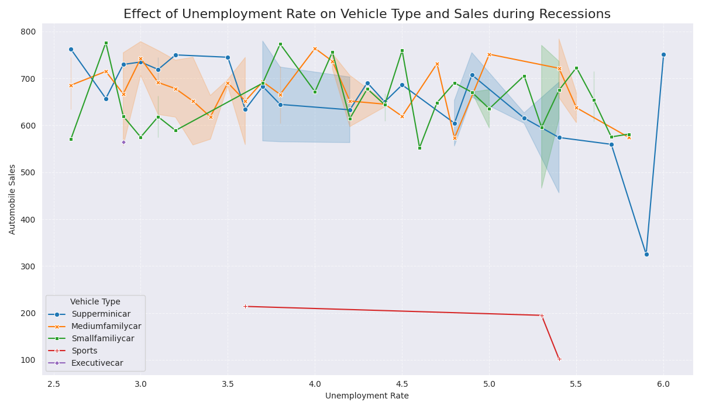
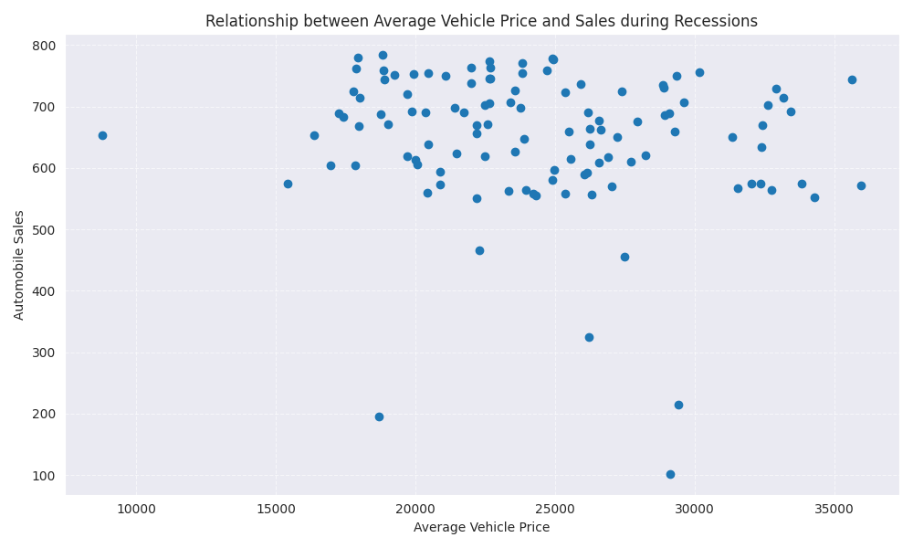
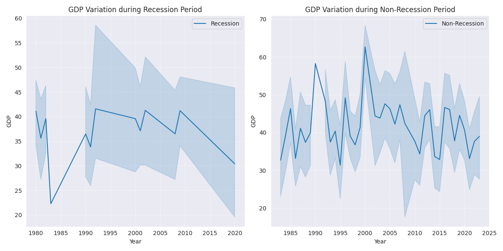
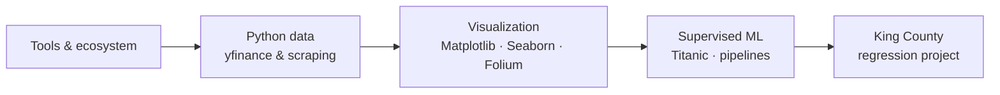

<p align="center">
  <a href="https://www.ibm.com/training/data-science" target="_blank" rel="noopener noreferrer">
    
  </a>
</p>

<h1 align="center">IBM Data Science Professional Certificate — Portfolio Repository</h1>
<h3 align="center">Coursera / IBM Skills Network labs, notebooks, assessed exercises, and datasets</h3>

<p align="center">
  
  
  
  
</p>

<p align="center">
  <a href="#about">About</a> ·
  <a href="#notebook-processes">Notebook processes</a> ·
  <a href="#artifacts">Artifacts</a> ·
  <a href="#learning-path">Learning path</a> ·
  <a href="#stack">Stack</a> ·
  <a href="#how-to-run">How to run</a> ·
  <a href="#structure">Structure</a> ·
  <a href="#certification">Certification</a> ·
  <a href="#author">Author</a>
</p>

---

<a id="about"></a>
## About

This repository gathers **notebooks and assets** used across the **IBM Data Science Professional Certificate** (Coursera / **IBM Skills Network**): from introductory **tools and ecosystem** topics through **data visualization**, **hands-on projects** (Titanic classification, King County housing regression), and **financial data** workflows with **yfinance** — aligned with official lab prompts and datasets.

> Assignments follow IBM course versions (Cloud Object Storage URLs and JupyterLite where applicable).

---

<a id="notebook-processes"></a>
## Notebook processes (what each lab actually does)

### `DataScienceEcosystem.ipynb` — tools and ecosystem

- Introduces **languages**, **libraries**, and **open-source tools** commonly used in data science.
- Short **Python** examples (arithmetic, simple conversions) to verify the runtime.
- **No analytical dataset pipeline** — foundation for the rest of the certificate.

### `tesla_data.ipynb` — market data and HTML tables

- **Extract stock time series** with **yfinance** (e.g. Tesla, GameStop as in the prompts): download, reset index, inspect.
- **Parse revenue or supplementary tables** from web pages with **requests** + **BeautifulSoup** (course pattern).
- **Clean** scraped frames (drop bad rows, normalize strings to numeric where required).
- **Plot** price history to relate **price dynamics** to the narrative questions in the lab.

### `DV0101EN-Final-Assignment-Part1-v2.ipynb` — visualization capstone (Part 1)

- Works with the **historical automobile sales** dataset from the Skills Network URL in the notebook.
- **EDA-style workflow:** load CSV, inspect columns, filter periods (e.g. recession vs. non-recession), aggregate by **vehicle type** or year.
- **Plot** with **Matplotlib** and **Seaborn**: line charts, bar charts, scatter, composite **subplots**, and **bubble** encodings where required.
- **Folium** section (per assignment): geographic summaries when the prompt asks for map-based visuals.
- Exported PNGs for reference are stored under **`figures/`** (see below).

### `scripts/DV0101EN-Final-Assign-Part-2-Questions.py` — Part 2 (script)

- Same DV0101EN module, **non-notebook** delivery: answers exercises in a **`.py`** file.
- Typically **loads** assignment data via **HTTP** (`requests`) into memory, then applies **pandas** operations and prints or saves results as the rubric expects.

### `House_Sales_in_King_Count_USA-*.jupyterlite.ipynb` — King County housing (regression project)

Structured in **modules** matching the methodology track:

1. **Import datasets** — reads `../data/kc_house_data_NaN.csv` (local path relative to `notebooks/`; JupyterLite users may download into the browser environment instead).
2. **Data wrangling** — handle **missing values**, type fixes, and feature cleanup suitable for regression.
3. **Exploratory data analysis** — distributions, correlations, relationships between **price** and **housing attributes** (sqft, bedrooms, waterfront, etc., per dataset columns).
4. **Model development** — train **regression** models (e.g. linear / polynomial pipelines as in the lab) to predict **price** or related targets.
5. **Model evaluation and refinement** — **R²**, residual thinking, and refinement steps (e.g. cross-validation / polynomial degree selection as instructed).

### `Practice Project-v1.ipynb` — Titanic survival (classification)

- **Binary classification** on the classic Titanic survival problem.
- **Preprocessing:** imputation, encoding categoricals, feature scaling as needed.
- **Pipelines** in **scikit-learn** combining transformers and estimators.
- **Compare** models such as **Random Forest** vs **Logistic Regression** with **cross-validation**.
- **Hyperparameter search** with **`GridSearchCV`** where the lab requires it.
- **Evaluate** with **accuracy**, **confusion matrix**, and **feature importance** where applicable.

---

<a id="artifacts"></a>
## Artifacts

| Path | Description |
|------|-------------|
| `notebooks/DataScienceEcosystem.ipynb` | Tools, languages, libraries, short Python checks |
| `notebooks/tesla_data.ipynb` | yfinance + web scraping + stock plots |
| `notebooks/DV0101EN-Final-Assignment-Part1-v2.ipynb` | Matplotlib, Seaborn, Folium (Part 1) |
| `scripts/DV0101EN-Final-Assign-Part-2-Questions.py` | DV0101EN Part 2 exercises |
| `notebooks/House_Sales_in_King_Count_USA-*.jupyterlite.ipynb` | King County regression project |
| `data/kc_house_data_NaN.csv` | Housing dataset (with NaN handling per lab) |
| `notebooks/Practice Project-v1.ipynb` | Titanic — ML pipelines and comparison |
| `figures/*.png` | Exported plots from visualization labs (reference) |
| `requirements.txt` | Python dependencies for local runs |

### Sample figures (DV0101EN — automobile sales / recession analysis)

The PNG files in **`figures/`** accompany the **visualization assignment** (recession-era sales, GDP context, slices by vehicle type). They are **not** stock charts for `tesla_data.ipynb`.

<p align="center">
  
  &nbsp;&nbsp;
  
</p>
<p align="center">
  
  &nbsp;&nbsp;
  
</p>
<p align="center">
  
  &nbsp;&nbsp;
  
</p>

---

<a id="learning-path"></a>
## Learning path (high level)



---

<a id="stack"></a>
## Stack

| Area | Tools (indicative) |
|------|--------------------|
| **Core** | Python, Jupyter, `pandas`, `numpy` |
| **Visualization** | `matplotlib`, `seaborn`, `plotly`, `folium` |
| **ML** | `scikit-learn` (pipelines, `GridSearchCV`, classification & regression) |
| **External data** | `yfinance`, `requests`, `beautifulsoup4` |
| **Environment** | `jupyter`, `notebook`, `ipykernel` |

Install everything with **`pip install -r requirements.txt`**.

---

<a id="how-to-run"></a>
## How to run

```bash
git clone https://github.com/sidnei-almeida/ibm_ds_certificate.git
cd ibm_ds_certificate

python3 -m venv .venv
source .venv/bin/activate   # Windows: .venv\Scripts\activate

pip install -r requirements.txt

jupyter notebook
# or: jupyter lab
```

From the repo root, open notebooks under **`notebooks/`** and run cells in lab order. For Part 2 of DV0101EN:

```bash
python scripts/DV0101EN-Final-Assign-Part-2-Questions.py
```

---

<a id="structure"></a>
## Repository structure

```
ibm_ds_certificate/
├── data/
│   └── kc_house_data_NaN.csv
├── figures/                 # exported PNG plots (reference)
├── notebooks/
│   ├── DataScienceEcosystem.ipynb
│   ├── tesla_data.ipynb
│   ├── DV0101EN-Final-Assignment-Part1-v2.ipynb
│   ├── House_Sales_in_King_Count_USA-20231003-1696291200.jupyterlite.ipynb
│   └── Practice Project-v1.ipynb
├── scripts/
│   └── DV0101EN-Final-Assign-Part-2-Questions.py
├── requirements.txt
└── README.md
```

---

<a id="certification"></a>
## Certification

The **IBM Data Science Professional Certificate** (Coursera) covers foundations of data science, tools, methodology, Python, SQL, analysis and visualization, machine learning, and a **capstone-style** integrator project.

This repo is **study and portfolio material** — it does not replace the official certificate; completion is validated by Coursera / IBM.

---

## Disclaimer

**Educational use only.** Course exercises **do not** constitute investment advice. Financial series and model outputs are **illustrative**.

---

<a id="author"></a>
## Author

| | |
| --- | --- |
| **Name** | **Sidnei Alves de Almeida** |
| **Profile** | Data scientist · Python · machine learning |
| **LinkedIn** | [Sidnei Almeida](https://www.linkedin.com/in/saaelmeida93/) |
| **GitHub** | [@sidnei-almeida](https://github.com/sidnei-almeida) |

---

## Credits

- **IBM** and **Coursera** — *IBM Data Science Professional Certificate* and **Skills Network** content.
- Open-source communities: **Project Jupyter**, **NumPy**, **pandas**, **scikit-learn**, and others.

<p align="center">
  <a href="https://skills.network" target="_blank" rel="noopener noreferrer">
    
  </a>
</p>

<p align="center">
  <sub>Turning data into insight and insight into impact.</sub>
</p>

<p align="center">
  If this repository helped you, consider starring it on GitHub.
</p>
